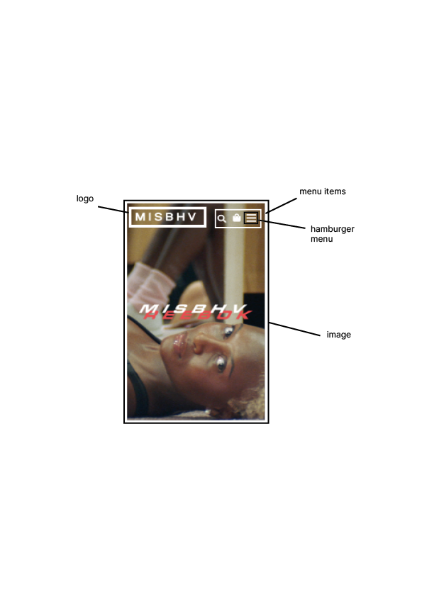
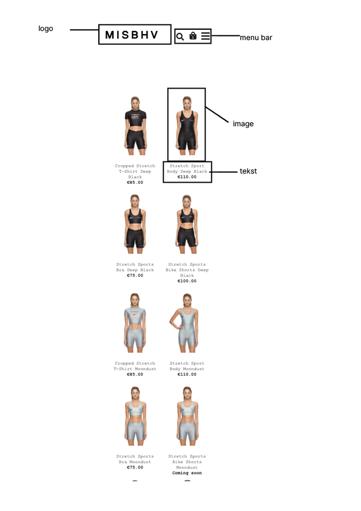
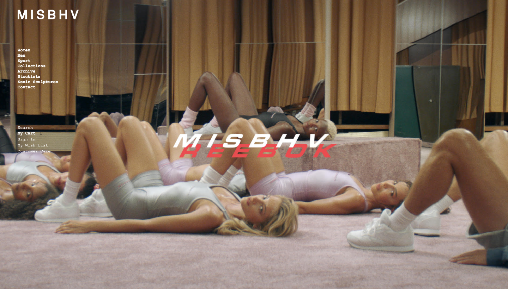

# Procesverslag
**Auteur:** -jouw naam-

Markdown cheat cheet: [Hulp bij het schrijven van Markdown](https://github.com/adam-p/markdown-here/wiki/Markdown-Cheatsheet). Nb. de standaardstructuur en de spartaanse opmaak zijn helemaal prima. Het gaat om de inhoud van je procesverslag. Besteedt de tijd voor pracht en praal aan je website.

## Bronnenlijst
1. https://codepen.io/shooft/pen/PoNQwXY
2. https://css-tricks.com/snippets/css/a-guide-to-flexbox/
3. https://www.w3schools.com/

## Eindgesprek (week 7/8)

Lastig om ul.items goed te krijgen, nog begin maken met css.
Sticky footer, lukte niet

## Voortgang 3 (week 6)

Uitlijnen items en nav naast elkaar lastig, 

## Voortgang 2 (week 5)

Begin met css, feedback gevraagd daarvoor 
hoe doe je background met css. 

## Voortgang 1 (week 3)
Begin maken met html, hoe beter li <a> maken. 

## Breakdownschets (week 1)

-uitwerken voor de 1e werkgroep

eind van de eerste week-

## Intake (week 1)
-uitwerken voor de kick-off werkgroep - begin van de eerste week-

**Je startniveau:** Blauw 

**Je focus:** Surface plane

**Je opdracht:** https://misbhv.com/

**Screenshot(s) van de eerste pagina (small screen):**

**Screenshot(s) van de tweede pagina (small screen):**

